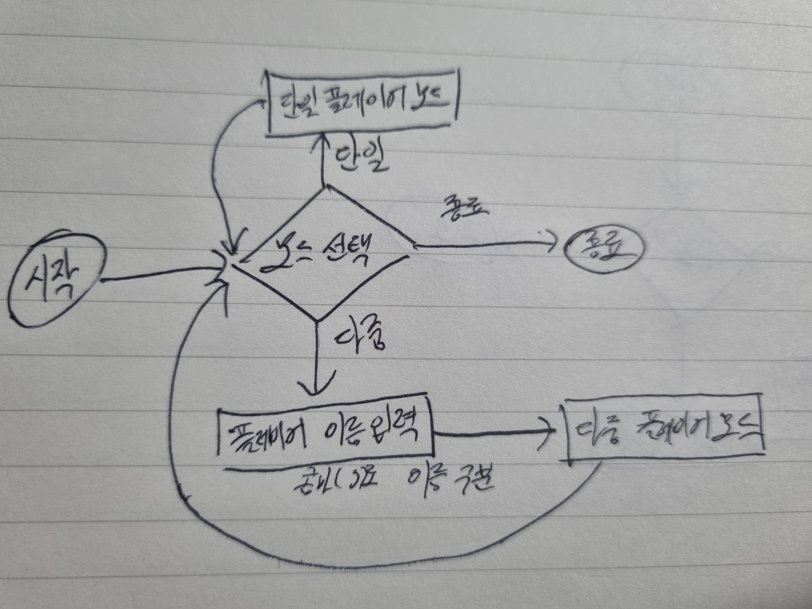
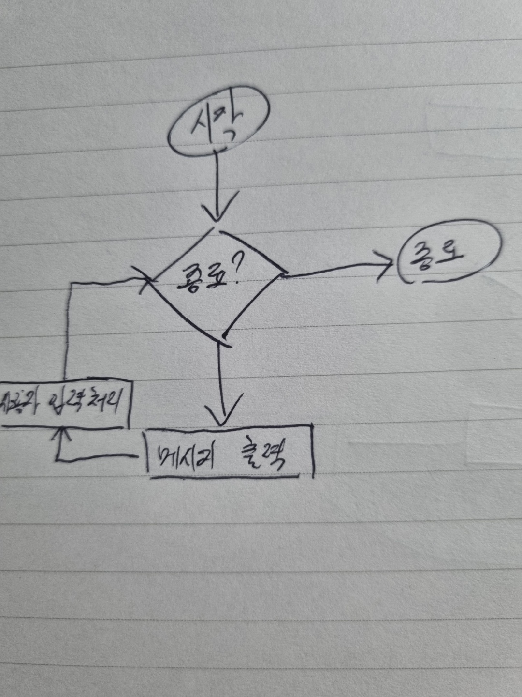
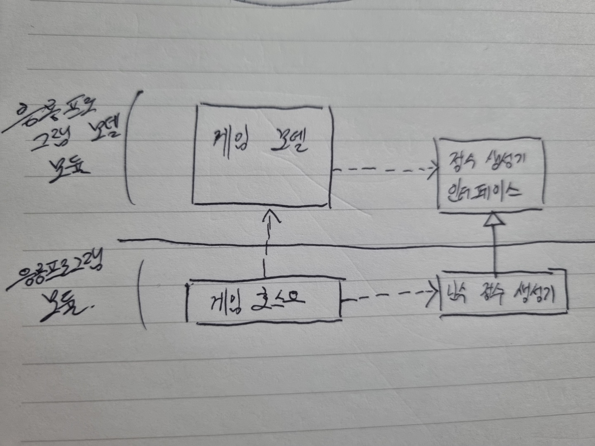

# TDD와 Junit5로 장난감 게임 만들기

> The RED : 이규원의 현실 세상의 TDD : 안정감을 주는 코드 작성 방법 강의 실습 내용입니다.

## 1. 요구사항

- 1부터 100까지의 임의의 정수를 맞추는 게임
- 플레이어가 숫자를 입력
    - 입력한 숫자가 정답보다 작으면 작다고 출력
    - 입력한 숫자가 정답보다 크면 크다고 출력
    - 입력한 숫자와 정답과 일치하면 라운드 종료
- 단일 플레이어 모드와 다중 플레이어 모드 지원
    - 단일 플레이어 모드 라운드가 종료되면 총 시도를 출력
    - 다중 플레이어 모드 라운드가 종료되면 승자를 출력

## 2. 설계

**하이 레벨 디자인**

  

  

**로우 레벨 디자인**

  

## 3. 프로젝트 베이스 설명

### 게임 응용 프로그램 모델 모듈

- `PositiveIntegerGenerator` : 정수 생성 인터페이스
    - `generateLessThanOrEqualToHundread()` : 100 이하의 수 생성

- `AppModel` : 인터페이스를 사용하는 게임 모델, 게임이 수행해야할 모형을 가지고 있다.
    - `isCompleted()` : 게임 종료 여부 파악
    - `flushOutput()` : 게임 모델이 진행하면서 만든 출력물을 반환하고, 출력 버퍼를 비운다.
    - `processInput()` : 콘솔로부터 사용자의 입력을 처리한다. 응용프로그램 호스트가 콘솔을 통해 받은 사용자 입력을 파라미터로 받아 처리한다.

### 응용 프로그램 모듈

- `RandomGenerator` : 난수 정수 생성기(구현체)
- `App` : 응용 프로그램 호스트, 메인 메서드를 가지고 있다.
  - 난수 생성기를 통해 AppModel 인스턴스를 만든다.
  - 콘솔 입력을 받을 준비를 한다.
  - 루프를 실행한다.
  - 루프가 종료되면 자원을 해제하고 게임을 종료한다.
